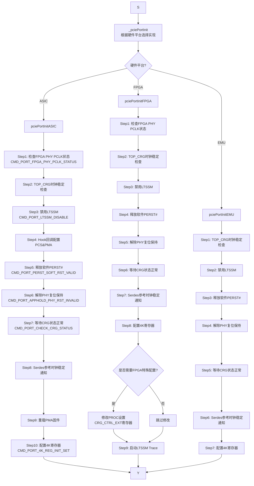
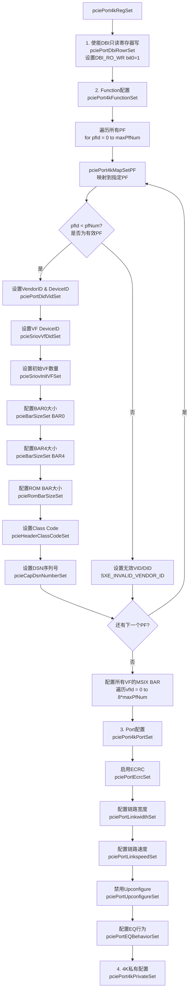
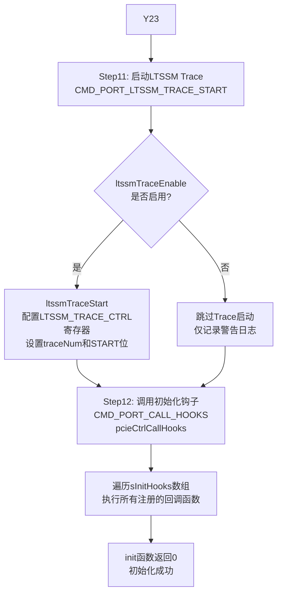
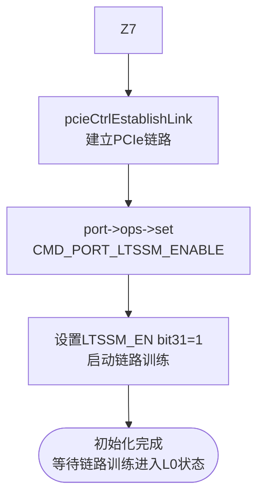

# PCIe PERST 中断处理与端口初始化流程图

## 整体流程概览

```
PERST中断触发
    ↓
pciePortPerstIsrHandler (中断处理入口)
    ↓
判断: PERST Assert 还是 Deassert?
    ↓
如果是 Deassert → 调用 port->ops->init() → 建立链路
如果是 Assert  → 调用钩子函数处理复位
```

---

## 详细流程图

### 1. PERST 中断处理层

```mermaid
graph TD
    A([PERST中断触发]) --> B[pciePortPerstIsrHandler<br/>中断入口]
    B --> C{port指针有效?}
    C -->|否| D[记录错误日志<br/>返回-1]
    C -->|是| E[pciePortPerstIntClr<br/>清除PERST中断标志]
    
    E --> F[pciePortPerstSync<br/>读取PERST同步状态]
    F --> G[pciePortPerstTrigModeGet<br/>获取触发模式]
    
    G --> H{是否为高电平触发?}
    H -->|是| I[不支持高电平触发<br/>返回]
    H -->|否| J[计算触发条件<br/>下降沿=0x0, 上升沿=0x1]
    
    J --> K{perstSyncStatus == trigCondition?<br/>判断Deassert/Assert}
    
    K -->|否: PERST Assert| L[记录日志: Perst assert detected]
    L --> M[pcieCtrlCallIrqHooks<br/>调用PERST_ASSERT钩子]
    M --> N([结束])
    
    K -->|是: PERST Deassert| O[记录日志: Perst deassert detected]
    O --> P{是否使用ISR任务队列?}
    
    P -->|是| Q[pcieIsrEnqueueEvent<br/>事件入队<br/>PCIE_CTRL_EVT_PERST_DEASSERT]
    Q --> R([结束<br/>由后台任务处理])
    
    P -->|否| S[<b>port->ops->init(port)</b><br/>调用端口初始化]
```

---

### 2. 端口初始化层 (_pciePortInit)



---

### 3. 4K寄存器配置详解 (CMD_PORT_4K_REG_INIT_SET)



---

### 4. LTSSM Trace 启动与钩子调用



---

### 5. 链路建立层



---

## 关键抽象层次总结

### 📌 第一层：中断处理层 (`pciePortPerstIsrHandler`)
**职责**: 快速响应 PERST 信号变化  
**关键决策**: 
- 区分 Assert(复位) 和 Deassert(释放)
- 支持两种处理模式：
  - **直接模式**: 立即调用 init()
  - **队列模式**: 将事件放入队列，由后台任务处理

**核心代码位置**: `/home/sam/minisoc_fw/pcie_ctrl/pi/tianxie/pcie_ctrl_tianxie_irq.c:632-697`

---

### 📌 第二层：端口初始化层 (`_pciePortInit`)
**职责**: 按顺序执行硬件初始化步骤  

**三大平台实现**:
1. **ASIC**: `pciePortInitASIC` - 11个步骤，包含PMA固件重载
2. **FPGA**: `pciePortInitFPGA` - 9个步骤，包含PROC特殊配置
3. **EMU**: `pciePortInitEMU` - 7个步骤，最简化流程

**通用步骤**:
1. ✅ 时钟检查 (TOP_CRG稳定)
2. ✅ LTSSM控制 (先禁用，最后启用)
3. ✅ 复位管理 (软件PERST#、PHY复位、CRG状态)
4. ✅ 寄存器配置 (4K空间配置)
5. ✅ Trace启动 (LTSSM状态跟踪)
6. ✅ Hook调用 (用户自定义扩展)

**核心代码位置**: `/home/sam/minisoc_fw/pcie_ctrl/pi/tianxie/pcie_ctrl_tianxie_core.c:1369-1680`

---

### 📌 第三层：命令抽象层 (`port->ops->set/get`)
**设计模式**: 命令表驱动 (`gPortSetCmdTable`)  

**优势**:
- 🎯 统一接口，隐藏具体实现
- 🔧 易于扩展新命令
- 💡 支持两种处理器模式：
  - `simple_handler`: 无参数处理函数
  - `param_handler`: 带参数处理函数

**命令表示例**:
```c
static const PcieCmdTableEntry_s gPortSetCmdTable[] = {
    { CMD_PORT_LTSSM_DISABLE,      NULL,                    pciePortLtssmSet           },
    { CMD_PORT_PERST_SOFT_RST_VALID, NULL,                  pciePortPersetSoftRstSet   },
    { CMD_PORT_CHECK_CRG_STATUS,   pciePortCheckCrgStatus,  NULL                       },
    { CMD_PORT_4K_REG_INIT_SET,    pciePort4kRegSet,        NULL                       },
    { CMD_PORT_LTSSM_TRACE_START,  pciePortLtssmTraceStart, NULL                       },
    { CMD_PORT_CALL_HOOKS,         pcieCtrlCallHooks,       NULL                       },
};
```

**核心代码位置**: `/home/sam/minisoc_fw/pcie_ctrl/pi/tianxie/pcie_ctrl_tianxie_core.c:1280-1330`

---

### 📌 第四层：4K寄存器配置层 (`pciePort4kRegSet`)

这是**最复杂的抽象**，包含四个子层次：

#### 4.1 DBI控制层
- **函数**: `pciePortDbiRowrSet`
- **作用**: 使能只读寄存器可写 (设置 `DBI_RO_WR` bit0=1)
- **寄存器**: `SXE_PCIE_4K_DBI_RO_WR_OFFSET`

#### 4.2 Function配置层 (`pciePort4kFunctionSet`)
**遍历所有PF进行配置**:
- ✅ VendorID/DeviceID 设置
- ✅ SR-IOV VF配置 (初始VF数量、VF DeviceID)
- ✅ BAR大小配置 (BAR0, BAR4, ROM BAR)
- ✅ Class Code 设置 (网络设备类 `0x020000`)
- ✅ DSN序列号设置

**VF配置**:
- 为每个虚拟功能配置 MSIX BAR (默认BAR4)
- 遍历范围: `vfId = 0 to 8*maxPfNum`

**核心代码位置**: `/home/sam/minisoc_fw/pcie_ctrl/pi/tianxie/pcie_ctrl_tianxie_core.c:873-990`

#### 4.3 Port配置层 (`pciePort4kPortSet`)
- ✅ **ECRC校验**: 启用端到端循环冗余校验
- ✅ **链路宽度**: 配置最大链路宽度 (x1/x4/x8/x16)
- ✅ **链路速度**: 配置最大链路速度 (Gen1~Gen6)
- ✅ **Upconfigure**: 禁用动态带宽升级
- ✅ **EQ预设**: 配置均衡器行为 (设置为0x3)

**核心代码位置**: `/home/sam/minisoc_fw/pcie_ctrl/pi/tianxie/pcie_ctrl_tianxie_core.c:1126-1180`

#### 4.4 私有配置层 (`pciePort4kPrivateSet`)
- 平台特定的额外配置
- 预留扩展点

---

### 📌 第五层：链路建立层 (`pcieCtrlEstablishLink`)
**最终动作**: 
- 调用 `port->ops->set(CMD_PORT_LTSSM_ENABLE)`
- 设置 `LTSSM_EN` 寄存器 bit31=1

**结果**: 
- 启动 PCIe 链路训练
- 状态机流转: Detect → Polling → Configuration → L0

**核心代码位置**: `/home/sam/minisoc_fw/pcie_ctrl/pi/tianxie/pcie_ctrl_tianxie_core.c:1623-1640`

---

## 数据流图

```
应用层 (Application)
    ↓ 调用 pcieCtrlEstablishLink()
    
API层 (pcie_ctrl_api.c)
    ↓ 查找对应端口
    ↓ 调用 port->ops->establishLink()
    
平台实现层 (pcie_ctrl_tianxie_core.c)
    ↓ _pciePortEstablishLink()
    ↓ 调用 port->ops->set(CMD_PORT_LTSSM_ENABLE)
    
命令分发层 (pcieCtrlPortSet)
    ↓ 查表 gPortSetCmdTable
    ↓ 调用 pciePortLtssmSet()
    
寄存器操作层 (pciePortLtssmSet)
    ↓ 读取 CTRL 寄存器
    ↓ 设置 bit31 = 1
    ↓ 写回 CTRL 寄存器
    
硬件层 (Hardware)
    ↓ LTSSM状态机启动
    ↓ 开始链路训练
```

---

## 关键数据结构

### PcieCtrlPort_s (端口结构)
```c
typedef struct PcieCtrlPort_s {
    U8 portId;                        // 端口ID
    U8 ctrlId;                        // 控制器ID
    U32 baseAddr;                     // 端口基地址
    PcieBifurMode_e bifurcation;      // 分叉配置
    bool ltssmTraceEnable;            // LTSSM trace使能
    
    // 配置信息
    PcieBasicId_s *basicId;           // 基础标识 (VID/DID)
    PcieBarConfig_s *bars;            // BAR配置
    PcieExpressCap_s *pcieCap;        // PCIe能力
    PcieSriovConfig_s *sriov;         // SR-IOV配置
    
    // 操作集 (关键!)
    const PciePortRegOps_s *regOps;   // 寄存器操作集
    const PciePortOps_s *ops;         // 端口操作集 ← init函数在这里
    
    // 钩子数组
    PcieCtrlInitHook_s sInitHooks[PCIE_MAX_INIT_HOOKS];
} PcieCtrlPort_s;
```

### PciePortOps_s (端口操作集)
```c
typedef struct PciePortOps_s {
    S32 (*init)(PcieCtrlPort_s *port);              // 初始化
    S32 (*deInit)(PcieCtrlPort_s *port);            // 反初始化
    S32 (*establishLink)(PcieCtrlPort_s *port);     // 建立链路
    S32 (*stopLink)(PcieCtrlPort_s *port);          // 停止链路
    S32 (*set)(PcieCtrlPort_s *port, U32 cmd, void *param);  // 设置命令
    S32 (*get)(PcieCtrlPort_s *port, U32 cmd, void *param);  // 获取命令
} PciePortOps_s;
```

---

## 时序图

```
时间轴 →

中断触发
    |
    |---> pciePortPerstIsrHandler()
    |       |---> 清中断标志
    |       |---> 读取PERST状态
    |       |---> 判断Deassert
    |       |
    |       |---> port->ops->init()  ← 关键调用
    |               |
    |               |---> Step1-9: 硬件初始化
    |               |---> Step10: 4K寄存器配置
    |               |       |---> DBI使能
    |               |       |---> PF/VF配置
    |               |       |---> Port配置
    |               |       |---> 私有配置
    |               |---> Step11: LTSSM Trace启动
    |               |---> Step12: 调用Hooks
    |               |
    |               <--- 返回0 (成功)
    |
    |---> pcieCtrlEstablishLink()
    |       |---> port->ops->set(LTSSM_ENABLE)
    |       |---> 设置LTSSM_EN bit31=1
    |
    v
链路训练开始 (Detect→Polling→Config→L0)
```

---

## 常见问题与调试技巧

### ❓ 问题1: init函数失败如何定位?
**方法**:
1. 查看日志中哪个 Step 报错
2. 检查返回值 `ret`
3. 确认对应的 CMD 是否有正确的 handler

### ❓ 问题2: 4K寄存器配置失败?
**检查点**:
1. DBI_RO_WR 是否已使能
2. PF映射是否正确 (`pciePort4kMapSetPF`)
3. BAR大小是否符合规范 (2的幂次)

### ❓ 问题3: LTSSM无法进入L0?
**排查步骤**:
1. 确认 LTSSM_EN 已设置
2. 检查链路宽度和速度配置
3. 查看 LTSSM Trace 日志
4. 验证对端设备是否正常

### 🔧 调试技巧
```c
// 在关键步骤添加日志
PCIE_CTRL_LOG(PCIE_LOG_LEVEL_INFO, 
    "[%s] Step%d completed, ret=%d\n", __func__, step_num, ret);

// GDB调试时检查端口状态
(gdb) p *port
(gdb) p port->status
(gdb) p port->pcieCap->caps.maxLinkSpeed
(gdb) p port->pcieCap->caps.maxLinkWidth
```

---

## 总结

这个设计采用了**分层抽象**的架构：

1. **中断层**: 快速响应，最小化处理
2. **初始化层**: 顺序执行，平台差异化
3. **命令层**: 统一接口，表驱动分发
4. **配置层**: 模块化配置，易于维护
5. **链路层**: 最终使能，启动训练

**优势**:
- ✅ 代码复用率高 (命令抽象层)
- ✅ 易于扩展 (添加新CMD只需修改表)
- ✅ 平台隔离 (ASIC/FPGA/EMU独立实现)
- ✅ 可测试性强 (每步都有返回值检查)
- ✅ 可维护性好 (清晰的层次和职责划分)

**核心文件**:
- 中断处理: `pcie_ctrl_tianxie_irq.c`
- 平台初始化: `pcie_ctrl_tianxie_core.c`
- LTSSM Trace: `pcie_ctrl_tianxie_dfx.c`
- 命令定义: `pcie_ctrl_common.h`

---

## 附录：各平台初始化步骤对比

| 步骤 | ASIC | FPGA | EMU | 说明 |
|------|------|------|-----|------|
| Step1 | ✅ PHY PCLK检查 | ✅ PHY PCLK检查 | ❌ | 确保物理层时钟就绪 |
| Step2 | ✅ CRG时钟检查 | ✅ CRG时钟检查 | ✅ CRG时钟检查 | TOP_CRG时钟稳定 |
| Step3 | ✅ LTSSM禁用 | ✅ LTSSM禁用 | ✅ LTSSM禁用 | 防止意外启动 |
| Step4 | ⚠️ PCS&PMA配置(Hook) | ❌ | ❌ | ASIC特有，待实现 |
| Step5 | ✅ 释放软件PERST# | ✅ 释放软件PERST# | ✅ 释放软件PERST# | 软件复位释放 |
| Step6 | ✅ 解除PHY复位 | ✅ 解除PHY复位 | ✅ 解除PHY复位 | 硬件复位释放 |
| Step7 | ✅ 等待CRG状态 | ✅ 等待CRG状态 | ✅ 等待CRG状态 | 轮询直到正常 |
| Step8 | ⚠️ Serdes时钟通知 | ✅ Serdes时钟通知 | ✅ Serdes时钟通知 | TODO: 需要回调 |
| Step9 | ✅ PMA固件重载 | ❌ | ❌ | ASIC特有 |
| Step10 | ✅ 4K寄存器配置 | ✅ 4K寄存器配置 | ✅ 4K寄存器配置 | 核心配置步骤 |
| Step10.1 | ❌ | ⚠️ PROC特殊配置 | ❌ | FPGA调试用 |
| Step11 | ✅ LTSSM Trace启动 | ✅ LTSSM Trace启动 | ✅ LTSSM Trace启动 | 状态跟踪 |
| Step12 | ✅ 调用Hooks | ✅ 调用Hooks | ✅ 调用Hooks | 用户扩展点 |

**符号说明**:
- ✅: 已实现
- ⚠️: 部分实现或待完善
- ❌: 不适用或未实现

---

**文档版本**: v1.0  
**最后更新**: 2026-05-30  
**作者**: AI Assistant  
**适用平台**: tianxie (可扩展到其他平台)
